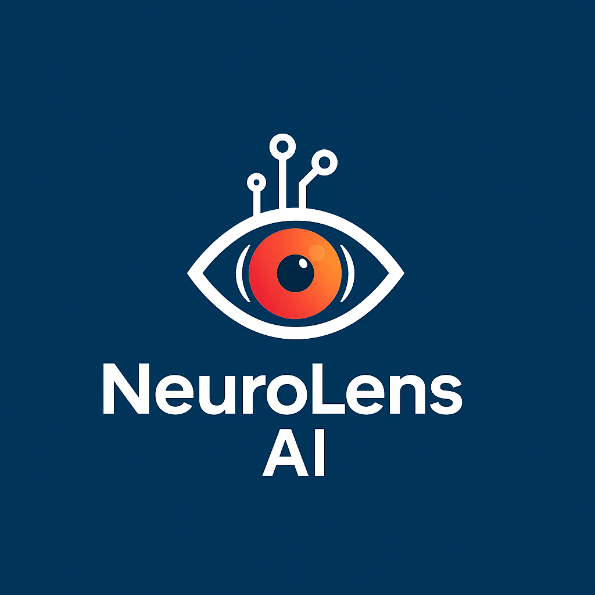

## 🧠 Neura Lense AI

  
 
 <em>Empowering early retinal disease detection through AI-powered vision.</em>  <strong>Built with Deep Learning · Flask · YOLO · Computer Vision</strong> 

## 🌟 Overview

Neura Lense AI is an advanced deep learning application designed to analyze retinal images and assist in the early detection of neurological and ophthalmic disorders such as Diabetic Retinopathy, Glaucoma, and Optic Neuropathy.

By leveraging powerful AI models and explainable visualizations, Neura Lense helps medical practitioners and researchers make more accurate, faster, and data-driven decisions — all through an intuitive, web-based interface.

## 🚀 Key Features

✅ AI-Powered Retinal Disease Detection — Identifies multiple vision-related conditions using ONNX-based deep learning models.
✅ Explainable AI (XAI) — Uses Grad-CAM and heatmap overlays for transparency and trust in predictions.
✅ Multilingual AI Summaries — Generates diagnostic summaries in English, Hindi, Gujarati, Tamil, Bengali, Marathi, Telugu, and more — breaking language barriers in healthcare.
✅ Flask Web Interface — Simple, responsive design for fast image uploads and clear results.
✅ Lightweight ONNX Model — Efficient inference with high accuracy across devices.
✅ Cross-Platform Ready — Runs locally or in the cloud, scalable for clinics and research labs.

## 🧩 Project Architecture
Neura-Lense/
 ┣ app.py                     # Main Flask application
 ┣ models/
 ┃ ┣ best.onnx                # Pre-trained ONNX model (downloaded at runtime)
 ┃ ┣ download_model.py        # Auto-download script for the model
 ┃ ┗ model_link_download.txt  # Manual download link
 ┣ templates/
 ┃ ┣ index.html               # Upload page
 ┃ ┗ result.html              # Results and analysis visualization
 ┣ static/
 ┃ ┣ assets/                  # Logos and icons
 ┃ ┣ css/                     # Stylesheets
 ┃ ┣ uploads/                 # User uploads (ignored in .gitignore)
 ┃ ┗ results/                 # Generated results (ignored in .gitignore)
 ┣ requirements.txt           # Python dependencies
 ┣ .gitignore
 ┗ README.md

## ⚙️ Installation & Setup
1️⃣ Clone the Repository
git clone https://github.com/your-username/Neura-Lense.git
cd Neura-Lense

2️⃣ Install Requirements
pip install -r requirements.txt

3️⃣ Download the Model Automatically
python models/download_model.py

(If you prefer manual download, use the link inside
models/model_link_download.txt
 .)

4️⃣ Run the Application
python app.py

5️⃣ Access the App

Open your browser and go to → http://127.0.0.1:5000/

## 🧠 Model Details

The AI model is trained on retinal image datasets to classify and detect multiple vision-related abnormalities.
It uses a Convolutional Neural Network (CNN) architecture exported in ONNX format for lightweight, cross-platform inference.

The model is optimized for interpretability and performance — balancing clinical relevance with computational efficiency.

## 🧬 Tech Stack
Layer	Technology
Frontend	HTML, CSS (via Flask Templates)
Backend	Flask (Python)
AI/ML	PyTorch / ONNX Runtime
Deployment	Flask Server / Localhost / Cloud
Visualization	Grad-CAM, OpenCV

## 🎥 App Preview

🎬 [Watch Demo Video on Google Drive](https://drive.google.com/file/d/1O4nkIq0xOf8GYGdzPwwVonQQmCnG9qPb/view?usp=sharing)

## 🔗 Model Download

📁 The pre-trained ONNX model (best.onnx) can be:

Automatically downloaded using:

python models/download_model.py

Manually downloaded from the link inside:
models/model_link_download.txt

## 📈 Future Enhancements

🩺 Add multi-disease classification (DR, AMD, Glaucoma).

☁️ Cloud-based inference API with auto-scaling.

📊 Doctor’s analytics dashboard.

🧠 Model Refinement & Continuous Learning — Periodically retrain and fine-tune the ONNX model using new, real-world datasets to improve accuracy, reduce bias, and adapt to diverse retinal images.

## 🧑‍💻 Author

## Malav Joshi
🎓 B.Tech in CSE (AI & ML) – Adani University
📍 Ahmedabad, India
📫 malavjoshi71@outlook.com

💼 [LinkedIn Profile](https://www.linkedin.com/in/malav-joshi-b57390216/)

## 📜 License

This project is licensed under the MIT License
.
Feel free to use, modify, and distribute this software with proper attribution.

## 💡 Tagline

“Your Eyes Tell a Story — Neura Lense Helps You Read It.”
